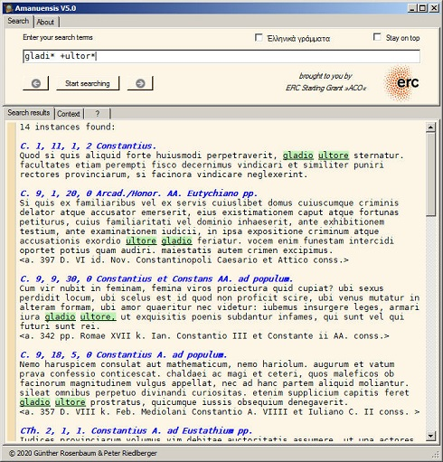

## Documenting steps of data manipulation

The documentation describes the creation of the base dataframe including the text of the Digest in structured machine-ready format. It also describes the creation of supporting structured data related to the text of the Digest, for example, authors of passages, legal themes covered in the Digest's 432 sections, and reconstructed characteristics of passages which aim to explain how the Digest was originally created.

### 1. Creation of the base "Ddf" dataframe

Documentation follows the order of output files. The title of individual steps include the method and the name of the output file in `[Method] > [outputFile]` format. `[Method]` and `[outputFile]` correspond with elements in `Ddf_flowchart`. These steps document the data manipulation pipeline from the raw text of the Digest to its relational database.

1. Manual editing > ROMTEXT.txt

Raw text is copied from the graphical interface of the [Amanuensis V4.0](http://www.riedlberger.de/08amanuensis.html) software developed by Peter Riedlberger and Günther Rosenbaum. Amanuensis incorporates the ROMTEXT database created by the University of Linz under the supervision of Josef Menner.[<sup id="inline1">1</sup>](#fn1)



The entire text is selected in the Amanuensis window which was then copied onto the clipboard. The raw text file is used to create `ROMTEXT.txt`.

2. Manual editing > Digest.txt

ROMTEXT.txt was opened in the vim text editor for manual editing. The final line of the Digest (which constitues about 49% of ROMTEXT.txt) was identified with a search command in vim. Subsequently, text which does not belong to the Digest was selected in vim's visual mode and got deleted. The new file containing the text of the Digest only was renamed and saved.

3. Ddf_001.py > Ddf_v001.csv

Python scripts are include in-line comments to help following the steps. `Ddf_001.py` takes `Digest.txt` as input and splits the raw text into a list of lines. The copyright notice (2 lines), the Digest's introductory notice (2 lines), and the erroneous line including the words `LIBER SEPTIMUS` are deleted. 

A set of regular expression patterns are initialised to identify the different types of lines in the Digest text. The three types are section titles (`section_ref_pattern`), reference headings of individual text units (`heading_ref_pattern`) and the text units themselves ('textunit_pattern).

Cleaning and pre-processing are performed by identifying line types with regular expressions in a 1D numpy array created from the list, and by locating lines which are not captured. These so-called _error lines_ point to a possible typographical error in the text, or indicate that the initial regular expressions need to be modified. 

As far as section titles are concerned, manual counting of these titles in the print edition of the Digest suggests that there should be a total of 432. An anomalous section title imported from ROMTEXT (1) may include an accidental line break which breaks the section title into two lines, (2) may include a lower-case "r" instead of "R" which marks the beginning of the section. These anomalies are amended inside the script. Nine anomalous section titles are noted for manual editing. 

4. Manual editing > Ddf_v002.csv

The table below summarises the 9 anomalous section titles and the correction made. Manual editing was carried out by consulting the print edition of the Digest published by Theodor Mommsen and Paul Krüger in 1889.[<sup id="inline2">2</sup>](#fn2)


| Reference | Anomaly | Correction made |
|:---|:---|:---|
| D. 4, 8, 0 R | colon, accidental line break | remove line break, update section_ref_pattern |
| D. 5, 1, 0 R | colon | update section_ref_pattern |
| D. 7, 7, 0 R | missing title | reconstruct from Mommsen's p. 108.: De operis servorum |
| D. 14, 2, 0 R | chevron/hat (^) in section title | remove chevron indicating alternative reading |
| D. 18, 7, 0 R | colon | see above |
| D. 29, 5, 0 R | colon | see above |
| D. 30, 0 R | one missing "0" | amend to "D. 30, 0, 0 R" |
| D. 33, 9, 0 R | missing full stop at the end of the title | full stop added |
| D. 43, 12, 0 R | additional full stop in title | replace with colon |

5. Ddf_002.py > Ddf_002x.csv

`Ddf_002.py` reads data from the manually corrected `Ddf_v002.csv`. The script creates a 1D numpy array with a reset index from the `csv` file. Updated regular expressions are used to check _error lines_ in the three different types of _section titles_, _reference headings_, and _text units_. The updated `section_ref_pattern` captures all 432 section titles, but there are 50 lines which are not captured by either `heading_ref_pattern` or `textunit_pattern`.

The script creates a pandas dataframe which includes the index and content of _error lines_ in the 1D numpy array. The dataframe is exported as a so-called _error file_ with the trailing "x" notation as `Ddf_v002x.csv` for manual editing.

6. Manual editing > Ddf_v003.csv

Anomalies in the `Ddf_v002.csv` file are manually amended according to _error lines_ noted in `Ddf_v002x.csv`. Corrections are extensively documented in `Ddf_v003x.csv`. Anomalies include accidental line breaks, broken reference headings, inconsistent diacritical marks, verbose notation of gaps in the manuscript. The corrected file is `Ddf_v003.csv`.

In addition to correcting the 50 anomalous lines, manual inspection has identified some characteristics which hinder the successful pattern matching of the three different line types in the Digest. 

The chevron `^` indicates an alternative reading. This sign is retained in text units in the format `^[text]^`. Lone chevrons are closed after manual inspection of Mommsen's print copy to identify which word should be marked. White space between chevrons is removed. Alternative readings marked by the double chevron are retained, but will be ignored during text analytics. 

In one instance in `D. 19, 5, 26, 1`, angular brackets `<>` indicate a suggested reading. The reading is retained and the angular brackets are removed. The notation does not appear elsewhere in the Digest.

The Digest includes some excessively long text units. Mommsen's print addition addresses this issue by splitting up and, in some cases, renumbering the text unit. 

- When the text unit in question stands at the end of a passage, that is, a set of text units originating from the same locus and constituting one quoted text, the number for split text units in the reference heading is incremented. For example, `D. 47, 3, 1, 1` is a quoted passage with only one text unit. In this case, Mommsen's edition splits the long text unit into two, and marks the second as `D. 47, 3, 1, 1^`. In this case, the chevron is removed and the reference heading is amended to `D. 47, 3, 1, 2`.

- When renumbering the split text unit would mess up the consolidated numbering in the section, Mommsen's print addition applies letters such as `D. 4, 3, 9, 4a`. Handling references as strings such as `4a` instead of integers such as `4` would cause unwarranted complications in machine processing. For this reason, text units split by Mommsen and marked with a trailing letter in the reference heading are merged into on long text unit. Mommsen's break is retained inside the text by quoting the reference letter inside chevrons such `^a^`. Therefore, the text units as split by Mommsen remain searchable, but will not affect machine processing of the reference headings. As text withon chevrons will be ignored during text processing (see above), the inserted in-line reference will not affect text analytics.

Where the reference heading was missing some information in ROMTEXT, instances were checked against Mommsen's print edition. Apart from the Digest book, section, passage and text unit numbers, reference headings include information about the source of the quoted text in the following pattern: `[jurist] [book number] [work title]` as in `Ulp. 55 ad ed.` where "Ulp." stands for the jurist Ulpian, "55" for the 55th book in Ulpian's work the title of which is abbreviated as "ad ed." which stands for "as edictum". If one or more value is missing in the `[jurist] [book number] [work title]` pattern, it is replaced in the form of `X. 0 x.`. The format guarantees that `[book number]` will be extracted as an integer, `[jurist]` and `[work title]` as strings.

7. Ddf_003.py > Ddf_v100.csv

`Ddf_003.py` reads data from the manually corrected `Ddf_v003.csv`. The script creates a 1D numpy array with a reset index from the `csv` file. Regular expressions have been updated to capture the three different types of lines: _section titles_, _reference headings_, and _text units_. As reference headings and text units come strictly in pairs, `textunit_pattern` has been dismissed. The check does not return any _error lines_, so the array is ready to be transformed into a structured pandas dataframe.

An empty Python dictionary is initiated with keys serving as column heads of the dataframe. Associated values are loaded systematically into a list.

```python
# Create dictionary with keys as column names
Ddict = {"Section_title":[], "Book_no": [], "Section_no": [], "Passage_no":
    [], "TextUnit_no": [], "TextUnit_ref": [], "TextUnit": []}
```

A set of regular expressions are defined to extract data from strings in the _section title_ and _reference heading_ lines. Please note that reference headings in Books 30-32 have only three levels, that is, they only include book, section and passage number, but no text unit number. For this reason, an alternative `heading3032_pattern` is defined for capturing reference headings in Books 30-32. An alterntive `ref_alt_pattern` extracts information in these cases. All other books are handled with `heading_pattern` and `ref_pattern`.

Data extracted from _section title_ and _reference heading_ lines are loaded into the Python dictionary by a nested loop which runs processes items of the 1D numpy array one by one. An empty `index_list_error` is initiated to collect the indices of any lines in the 1D numpy array which is not sorted by the loop. The fact that no item is added to the `index_list_error` suggests that all lines are successfully captured and sorted.

The Python dictionary is transformed into a pandas dataframe and exported as **`Ddf_v100.csv`**. This is the master file, the core of the future Digest database. It has 21055 rows corresponding to the number of text units in the Digest.

### 2. Creation and linking of the "BKO" dataframe

Friedrich Bluhme's seminal article published in 1820 set out a theory about the compositional history of the Digest.[<sup id="inline3">3</sup>] Bluhme examined the order passages in the thematic sections and discovered a pattern. He suggested that Tribonian, who was charged with the editing of the Digest by Justinian, created three committees to review and excerpt juristic works. According to Bluhme's theory, passages supplied by the committee responsible for works in the so-called "Sabinian mass" were put in the beginning of thematic sections. In a similar fashion, passages excerpted from the "edictal mass" were recorded in the middle while passages form the "Papinian mass" were recorded at the end of the thematic sections. Bluhme numbered the works in the three masses which were revised by Paul Krüger and published in the appendix of Mommsen's print edition of the Digest (pp. 874-878) as the _Ordo librorum iuris veteris in compilandis Digestis observatus_ ("The order of old juristic books observed in the compilation of the Digest").

Tony Honore,[<sup id="inline4">4</sup>] Dario Mantovani[<sup id="inline5">5</sup>] and other scholars scrutinised the Bluhme-Krüger Ordo (BKO) and amended some errors. Bluhme's theory stands to be true, but unproven. Honore supplemented the BKO with a second tier by identifying sub-groups within the three masses according to a common genre, author or subject. The current BKO dataframe has been created according to Honore's revision.[<sup id="inline6">6</sup>]

1. Manual editing > BKO_v001.txt > BKO_v002.txt

Honore's revised BKO table is copied from the pdf copy of his article published in _Roman Legal Tradition_ in 2006. Headers, footers, footnote numbers and footnotes are removed. Numbering has been found erroneous in three instances. Errors are checked against the BKO published in Mommsen and corrected manually to create BK_Ordo_v002.txt.

| Error | Correction made |
|:---|:---|
| 69. Paulus 3 ad legem Aeliam Sentiam | number changed to 70 |
| 70. Ulpianus 4 ad legem Aeliam Sentiam | number changed to 71 |
| (xxii) SC Trebellianum group. | changed to: (xxi) SC Tertullianum group. |

2. BKO.py > BKO_v001.csv

The script reads `BKO_v002.txt` and extracts structured information by a regular expression pattern. An empty Python dictionary is initiated with keys serving as column heads of the BKO dataframe. Associated values are loaded systematically into a list.

```python
# Create an empty python dictionary with keys as column labels
BKO_dict = {'BKO_no':[], 'bis':[], 'Jurist_name':[], 'Number_of_books':[], 'Work_title':[]}
```

The dictionary is transformed into a dataframe which, in turn, is exported as `BKO_v001.csv` for further manual editing.

3. Manual editing > BKO_v002.csv

`BKO_v001.csv` is opened in libreoffice_calc to enter and edit data manually. The spreadsheet inlcudes the follwing column labels:

| Column label | Description |
|:---|:---|
| BK_Ordo_no | BKO number according to Honore's revision
| Honore_group_name | name of the sub-group of works identified by Honore |
| Honore_group_type | sub-group's type: author ("a"), genre ("g"), subject ("s") or unattached ("u") |
| Honore_group_no | sub-group's number |
| BK_Ordo_no_rev | unrevised BKO number |
| Jurist_name | name of jurist associated with a work |
| Number_of_books | number of books in the work |
| Work_title | title of the work |
| Work_ref | abbreviated reference in the format used in the reference headings of Digest text units |
| BK_mass | work's mass: Sabinian ("S"), edictal ("E") or Papinian ("P")
| Note | any additional information |

In addition to the works listed in the BKO revised and supplemented by Honore, the spreadsheet includes reference headings of works which the BKO does not include by systamtically examining `Ddf_v100.csv`. Honore's revised BKO has 275 numbered works, the number of works listed here is 299. Some of these works are defined as parts of a larger multi-book work. For example, Ulpian's commentary on the Perpetual Edict (_ad edictum_) has 81 books of which, acording to the BKO, books 26-51 constitute one item in the Sabinian mass that its associated committee excerpted for the Digest's 432 theamtic sections. This item's abbreviated title is "Ulp. 26-51 ad ed." which follows the format of reference headings in ROMTEXT.

Long strokes ("–") are replaced with short ones ("-") throughout the dataframe.

4. Ddf_004.py > Ddf_v101.csv

The Python script in `Ddf_004.py` reads `Ddf_v100.csv` and manipulates its data to create a link between the `Ddf` and the `BKO` dataframes.

The script removes the book number from items stored in the `TextUnit_ref` column, so that "Ulp. 1 inst." becomes "Ulp. inst." where "Ulp." stands for the author-jurist called Ulpian and "inst." for the title of his work "institutiones". The manipulated series is inserted into the  `Ddf` dataframe with the label `Work`.

While in most cases work is equivalent with the item stored and listed in the `BKO` dataframe, split multi-volume works constitute an exception. For example, a text unit quoted from the 31st book of Ulpian commentary on the _Perpetual Edict_ ("Ulp. 31 ad ed." in the `TextUnit_ref` column) provides the work reference "Ulp. ad ed." in the `Work` column, but the `BKO` considers that the 81 books of Ulpian's commentary were not processed as one item, but only a part constituted by books 26-51. Therefore, the `BKO` reference is not "Ulp. ad ed." as shown in the `Work` column, but "Ulp. 26-51 ad ed."

For this reason, affected multi-volume works in the `Work` column is manipulated further to create a column `BKO_key` where items correspond to the BKO references stored in the `Work_ref` column on the `BKO` dataframe. The following items in `Work` are split and manipulated with regular expressions in the Python script.

1. "Paul ad ed."
2. "Paul sent."
3. "Gaius. ad ed. provinc."
4. "Ulp. ad ed."
5. "Paul ad Plaut."
6. "Marcian. reg."
7. "Paul. resp."
8. "Scaev. resp."
9. "Ulp. fideicomm."
10. "Valens. fideicomm."
11. "Maec. fideicomm."
12. "Hermog. iuris epit."
13. "Tryph. disp."
14. "Proc. epist."

It should be noted that in three instances, `BKO` splits the work in the middle of a book which means it cannot be decided where the particular text unit belongs, if one only takes the book number into account.

**Paul. 1 sent. - 80 instances**: 
The text unit belongs either to "Paul. 1 sent." standing for the beginning of the 1st book of Paul's _sententiae_, or to "Paul 1-2 sent." standing for the end of the 1st book which is treated together with the 2nd book. These text units are stored with "Paul. 1 sent." as their `BKO_key` and require manual examination.

**Paul. 48 ad ed. - 36 instances**: 
The text unit belongs either to "Paul. 28-48 ad ed." standing for books 28-47 as well as the beginning of book 48 in Paul's commentary on the _Perpetual Edict_, or to "Paul 48-49 ad ed." standing for the end of book 48 book which is treated together with the book 49. These text units are stored with "Paul. 48 ad ed." as their `BKO_key` and require manual examination.
	
**Ulp. 55 ad ed. - 49 instances**: 
The text unit belongs either to "Ulp. 54-55 ad ed." standing for book 54 and the beginning of book 55 Ulpian's commentary on the _Perpetual Edict_, or to "Ulp. 55 ad ed." standing for the rest of book 55 book. These text units are stored with "Ulp. 55 ad ed." as their `BKO_key` and require manual examination.

5. Manual editing > Ddf_v102.csv and BKO_

References in the `TextUnit_ref`, `Work` and `BKO_key` columns of `Ddf_v101.csv` associated with "Valens" are modified so that a full stop is added after the name "Valens." This ensures consistency and good data capture in the next processing phase. The file `Ddf_v102.csv` is saved in the `input` folder.

Long strokes ("–") are replaced with short ones ("-") throughout the dataframe.

6. Ddf_BKO_check_1.py > BKO_errors_1.txt

The script checks the consistency of reference formats in the `Ddf` and `BKO` dataframes. It reads the `BKO_key` column from `Ddf_v003.csv` and the `Work_ref` column from `BKO_v002.csv` and strips trailing whitespaces. There are 403 unique entries in the `BKO_key` column of `Ddf` which are checked against the items of the `Work_ref` column in `BKO`. Matching entries (251) follow the predefined format. The list of non-matching entries (152) are written into a txt file for manual investigation and editing. Such entries may need to be amended in `Ddf` or a matching entry needs to be added to the `BKO` dataframe. There needs to be full one-to-one correspondence between `Ddf` and `BKO`.

7. Manual editing > Ddf_v103.csv and BKO_v003.csv

`Ddf` dataframe is inspected according to the list of 152 anomalous entries in `BKO_errors.csv`. Typographical errors and inconsistent entries are manually corrected in `Ddf` while entries in the `BKO` are updated when necessary.

8. Ddf_BKO_check_2.py > BKO_errors_2.txt

The same script is run on the manually corrected `Ddf_v103.csv` and `BKO_v003.csv` files. Matching entries (285) follow the predefined format and found in `BKO`. The list of non-matching entries (24) are elements in the `BKO_key` columns of `Ddf` which do not appear in the `BKO`. These anomalous entries are written to `BKO_errors_2.txt` and used for a second round of manual editing.

9. Manual editing > Ddf_v104.csv and BKO_v004.csv

There are three inherently ambiguous references for which separate `BKO` entries have been created:

| BKO entry name | Ambiguity | Notes |
| :--- | :--- | :--- |
| Paul. ?1 sent. | the text unit either belongs to “Paul. 1 sent.” (BKO 205) or “Paul. 1-2 sent.” (BKO 207) | alternatives belong to the same BKO mass (edictal) and Honore group (sententiae-iuris epitomae, 16); this information is retained | 
| Ulp. ?55 ad ed. | the text unit either belongs to “Ulp. 54-55 ad ed.” (BKO 112) or “Ulp. 55 ad ed.” (BKO 116) | alternatives belong to the same BKO mass (edictal) and Honore group (transferred edictal commentaries, 28); this information is retained | 
| Paul. ?48 ad ed. | the text unit either belongs to “Paul. 28-48 ad ed. (BKO 5) or “Paul. 48-49 ad ed.” (BKO 121) | alternatives belong to different BKO masses (Sabinian and edictal) and Honore groups, this information is removed |

For now, this ambiguity of the Bluhme-Kruger Ordo is left unsolved. 

10. Ddf_BKO_check_3.py > BKO_errors_2.txt

The same script is run a third time on the manually corrected `Ddf_v104.csv` and `BKO_v004.csv` files. Matching entries (293) follow the predefined format and found in `BKO`. There are no non-matching entries which means that all elements in the `BKO_key` columns of `Ddf` correspond to an item in the `Work_ref` column of `BKO`. 

Some `BKO` items do not appear in `Ddf`. Two of these references ("Ulp. de off. consularium." and "Gai. l. s. ad ed. pu.") might have been absorbed by mistake by another work with a very similar title. "Ulp. 55 ad ed." and "Paul. 1 sent." are inherently ambiguous titles which may belong to one of two alternatives. There are two missing values in the `Work_ref` column of `BKO` at (1) Callistratus' de edicti monitori which appear twice in the Ordo by Bluhme and Kruger, and hence one is dropped here (BKO 99), and (2) book 19 of Gaius' ad edictum provinciale (BKO 122) which overlaps with "Gai. 1-8, 19 ad ed. provinc." (BKO 98).

The manually corrected `Ddf_v104.csv` and `BKO_v004.csv` files are free from errors and any remaining ambiguous entries have been documented. These files are copied into the output folder.

### 3. Additional dataframes

1. Ddf_sections.py > Ddf_sections.csv, Ddf_Section_IDs.csv

The script initiates a dataframe `df` with the `Section_title` and `Book_no` columns from `Ddf_v104.csv`. It counts the number of thematic sections (432) with 0 indexing and adds a section_id to each of the 21055 lines associated with a Digest text unit. All items in the anomalous books 30-32 of the Digest bears the same section title. Here a new thematic section is forced to start at the beginning of each book even though the section title stays the same. The section_id is inserted into the `df` as a new column while column `Book_no` is dropped. The dataframe is exported as `Ddf_sections.csv`.

An additional dataframe including section_IDs with their corresponding section titles is created and exported as `Ddf_Section_IDs.csv`.

2. Ddf_IDs.py > Ddf_IDs.csv, Ddf_BKO_IDs.csv, Ddf_Work_IDs.csv, Ddf_Book_IDs.csv

The script initiates a dataframe `df` with the `BKO_key`, `Work` and `TextUnit_ref` columns from `Ddf_v104.csv`. It creates separate dataframes for unique `BKO_key` (294), `Work` (251), and `TextUnit_ref` values (1352) where values are sorted alphabetically and associated with a unique ID. These dataframes are exported as `Ddf_BKO_IDs.csv`, `Ddf_Work_IDs.csv` and `Ddf_Book_IDs.csv`.

The script links the reference IDs above with the 21055 text units of the Digest by merging dataframes on unique values. The dataframe is streamlined and arranged for comfortable reading before it is exported as `DdfIDs.csv`. 

### Footnotes

[<sup id="fn1">1</sup>](#inline1) Georg Klingenberg, "Die ROMTEXT-Datenbank," _Informatica e diritto_ 4 (1995): 223-232.

[<sup id="fn2">2</sup>](#inline2) Theodor Mommsen & Paul Kruger, _Corpus Iuris Civlis. Editio stereotypa quinta. Vol 1: Institutiones. Digesta._ Berlin: Weidmann, 1889.

[<sup id="fn3">3</sup>](#inline3) Friedrich Bluhme, "Die Ordnung der Fragmente in den Pandectentiteln: Ein Beitrag der Entstehungsgeschichte der Pandecten," _Zeitschrift der Savigny-Stiftung für Rechtsgeschichte_ 4 (1820): 257-472.

[<sup id="fn4">4</sup>](#inline4) Tony Honore, "Justinian's Digest: The distribution of authors and works to the three committees," _Roman Legal Tradition_ 3 (2006): 1-47.